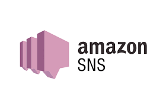
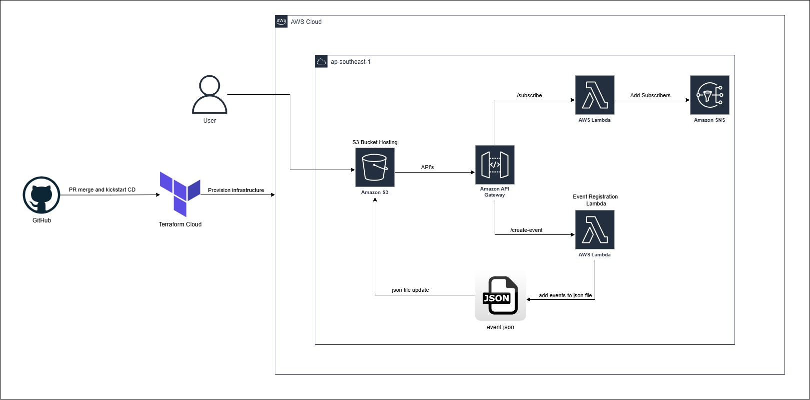
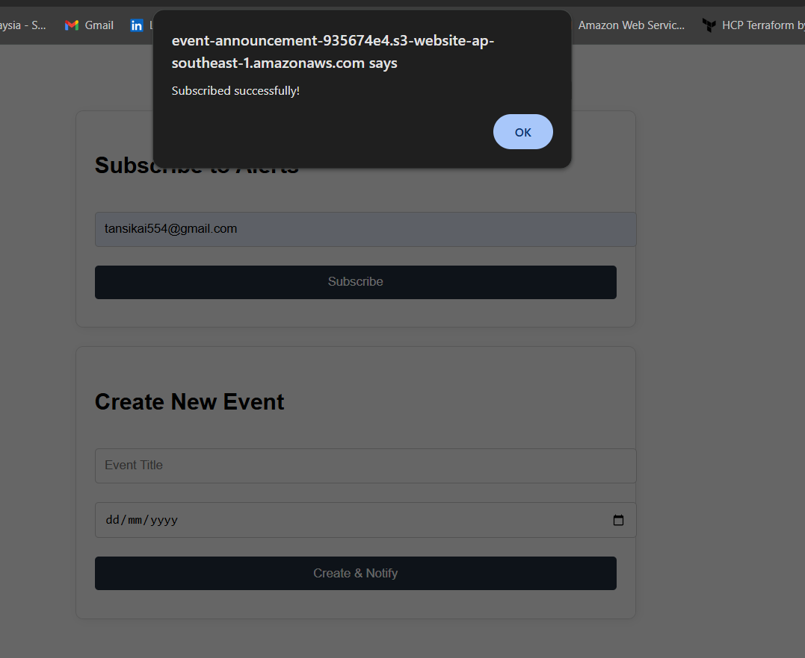
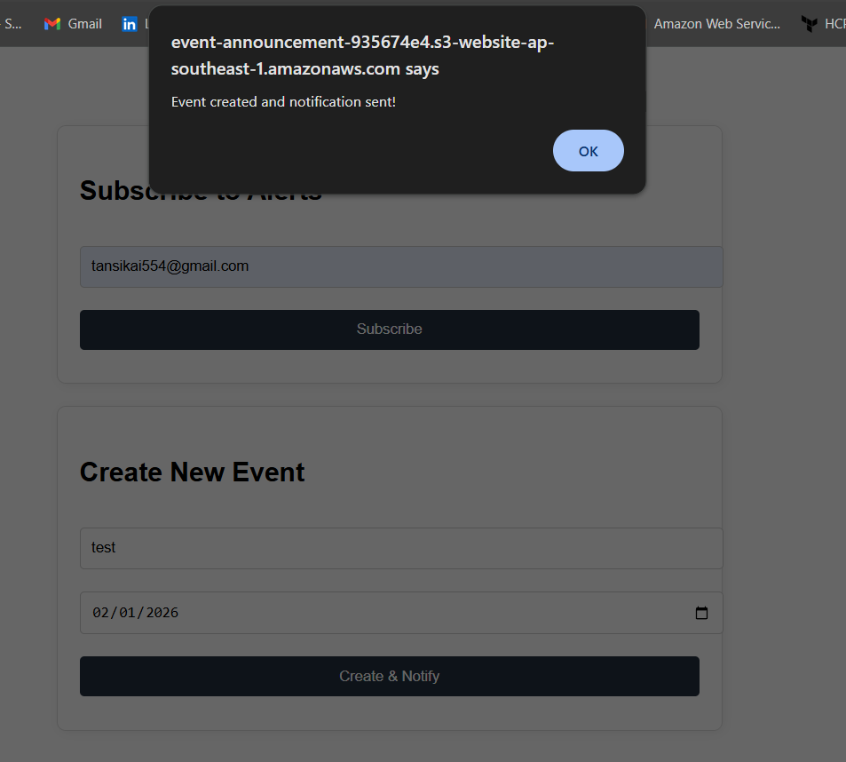
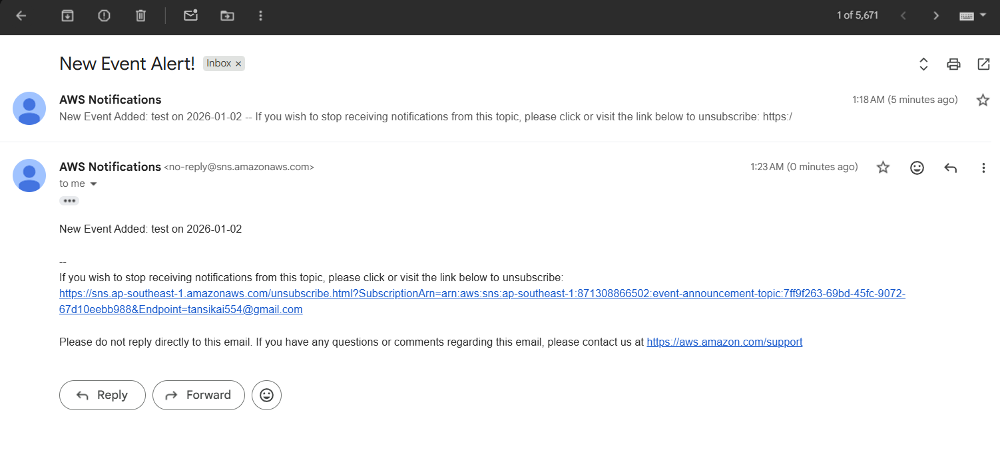

[![Contributors][contributors-shield]][contributors-url]
[![Forks][forks-shield]][forks-url]
[![Stargazers][stars-shield]][stars-url]
[![Issues][issues-shield]][issues-url]
[![Unlicense License][license-shield]][license-url]
[![LinkedIn][linkedin-shield]][linkedin-url]

   <h1>📢 Serverless Event Notifier</h1>
   
   

      <strong>Automated Multi-Channel Event Distribution System</strong> 
   
 The <strong>Serverless Event Notifier</strong> is a full-stack solution enabling organizations to manage event listings and instantly broadcast updates to subscribers. Built with a decoupled microservices architecture, it leverages AWS Lambda, SNS, and S3 to provide a highly scalable, zero-maintenance notification pipeline. 

 

 
[![Infrastructure CI][ci-shield]][ci-url]
[![Production Deployment][cd-shield]][cd-url]
[![Update Documentation][docs-shield]][docs-url]

 

<a href="#about-the-project"><strong>Explore the docs »</strong></a>

   
Table of Contents

   <ol>
      <li><a href="#about-the-project">About The Project</a></li>
      <li><a href="#built-with">Built With</a></li>
      <li><a href="#use-cases">Use Cases</a></li>
      <li><a href="#architecture">Architecture</a></li>
      <li><a href="#file-structure">File Structure</a></li>
      <li><a href="#technical">Technical Reference</a></li>
      <li><a href="#getting-started">Getting Started</a></li>
      <li><a href="#gitops">GitOps & CI/CD Workflow</a></li>
      <li><a href="#usage">Usage</a></li>
      <li><a href="#roadmap">Roadmap</a></li>
      <li><a href="#challenges-faced">Challenges</a></li>
      <li><a href="#well-architected">Well Architected Framework</a></li>
      <li><a href="#acknowledgements">Acknowledgements</a></li>
   </ol>

<h2 id="about-the-project">About The Project</h2>

 This project focuses on the <strong>Decoupled Pub/Sub Pattern</strong>. It demonstrates how to handle asynchronous workflows—where a user creates an event in a web dashboard, and the system automatically updates a data store (S3) while simultaneously triggering a notification broadcast (SNS). The entire lifecycle, from the frontend hosting to the backend API Gateway triggers, is provisioned via <strong>Terraform</strong> for 100% reproducible infrastructure. 

<a href="#readme-top">↑ Back to Top</a>

<h2 id="built-with">Built With</h2>

   
   
   
   
   
   

<ul>
   <li><strong>Vanilla JS + HTML5:</strong> Clean, lightweight frontend using Fetch API for asynchronous backend calls.</li>
   <li><strong>Terraform:</strong> Comprehensive IaC for API Gateway, Lambda, SNS, and S3 Static Web Hosting.</li>
   <li><strong>AWS SNS:</strong> Managed Pub/Sub service for handling email subscriptions and message broadcasting.</li>
   <li><strong>AWS Lambda (Node.js):</strong> Serverless functions for processing subscriptions and updating event metadata.</li>
   <li><strong>Amazon S3:</strong> Dual-purpose storage used for static website hosting and persistent JSON data storage.</li>
   <li><strong>API Gateway:</strong> RESTful entry point with integrated CORS handling and CloudWatch logging.</li>
</ul>

<a href="#readme-top">↑ Back to Top</a>

<h2 id="use-cases">Use Cases</h2>
<ul>
   <li><strong>Community Announcements:</strong> Allow members to sign up for email alerts for local town hall or club meetings.</li>
   <li><strong>Internal IT Alerts:</strong> A dashboard for admins to post system maintenance windows and notify all stakeholders instantly.</li>
   <li><strong>Marketing Campaigns:</strong> Quick-deploy landing pages to capture email leads and send instant promotion details.</li>
</ul>

<a href="#readme-top">↑ Back to Top</a>

<h2 id="architecture">Architecture</h2>

 The system utilizes a <strong>Serverless Event-Driven Architecture</strong>: 

<ol>
   <li><strong>Frontend Layer:</strong> Static HTML/JS hosted on S3 sends POST requests to API Gateway.</li>
   <li>
      <strong>Logic Layer:</strong> API Gateway triggers Lambda functions for two specific actions:
      <ul>
         <li><code>Subscriber Lambda</code>: Registers email addresses to an SNS Topic.</li>
         <li><code>CreateEvent Lambda</code>: Updates <code>events.json</code> in S3 and publishes a message to the SNS Topic.</li>
      </ul>
   </li>
   <li><strong>Notification Layer:</strong> SNS fan-outs the message to all "Confirmed" email subscribers.</li>
   <li><strong>Infrastructure Layer:</strong> Terraform manages the deployment, including API Gateway method responses (CORS) and IAM roles.</li>
</ol>

<a href="#readme-top">↑ Back to Top</a>

<h2 id="file-structure">File Structure</h2>
<pre>AWS-TERRAFORM-EVENT-ANNOUNCEMENT-SYSTEM/
├── .github/workflows/
│   ├── cd.yml                            # Production Deployment (OIDC + S3 Sync)
│   ├── ci.yml                            # Terraform PR Insights (Checkov, TFLint, Plan)
│   └── documentation.yml                 # Automated Documentation Sync via terraform-docs
├── .terraform/                           # Terraform local working directory
├── assets/                               # Documentation images and UI design icons
├── modules/
│   ├── api/                              # API Gateway Module
│   │   ├── main.tf                       # REST API, Methods, and CORS config
│   │   ├── variables.tf
│   │   └── outputs.tf
│   ├── lambda/                           # Serverless Logic Module
│   │   ├── src/                          # Source Code
│   │   │   ├── subscriber.js             # Handles SNS email subscriptions
│   │   │   ├── create_event.js           # Updates S3 and triggers SNS broadcast
│   │   │   ├── lambda_subscriber.zip     # Generated by Terraform (archive_file)
│   │   │   └── lambda_create.zip         # Generated by Terraform (archive_file)
│   │   ├── main.tf                       # Lambda functions, IAM Roles, and SNS
│   │   ├── variables.tf
│   │   └── outputs.tf
│   └── storage/                          # S3 Frontend Module
│       frontend/                         # Static Web Assets (Source)
│       │   ├── index.html.tftpl          # Dynamic template for API URL injection
│       │   ├── style.css                 # UI styling
│       │   └── events.json               # Data store for the event list
│       ├── main.tf                       # S3 Bucket, Hosting, and Public Policies
│       ├── variables.tf
│       └── outputs.tf
├── scripts/                              # Automation & Testing
│   └── post-deploy-test.sh               # Post-CD Integration health checks
├── .terraform.lock.hcl                   # Provider version lock file
├── main.tf                               # Root module (Orchestrates modules)
├── .pre-commit-config.yaml               # Local git-hook orchestration
├── .tflint.hcl                           # TFLint AWS ruleset configuration
├── .checkov.yml                          # Checkov scan ignore list
├── .terraform-docs.yml                   # Config for terraform documentation during workflow
├── variables.tf                          # Global variables
├── outputs.tf                            # Final consolidated endpoint outputs
├── README.template.md                    # Project documentation
└── terraform.tfstate                     # Local state file tracking resources
</pre>

<a href="#readme-top">↑ Back to Top</a>

<h2 id="technical">Technical Reference</h2>
This section is automatically updated with the latest infrastructure details.

<b>Detailed Infrastructure Specifications</b>

<!-- BEGIN_TF_DOCS -->

## Requirements

| Name                                                                     | Version  |
| ------------------------------------------------------------------------ | -------- |
|  [terraform](#requirement_terraform) | >= 1.5.0 |
|  [aws](#requirement_aws)                   | ~> 5.0   |
|  [random](#requirement_random)          | ~> 3.0   |

## Modules

| Name                                                     | Source            | Version |
| -------------------------------------------------------- | ----------------- | ------- |
|  [api](#module_api)             | ./modules/api     | n/a     |
|  [lambda](#module_lambda)    | ./modules/lambda  | n/a     |
|  [storage](#module_storage) | ./modules/storage | n/a     |

## Resources

No resources.

## Inputs

| Name                                                            | Description                           | Type     | Default       | Required |
| --------------------------------------------------------------- | ------------------------------------- | -------- | ------------- | :------: |
|  [aws_region](#input_aws_region) | The AWS region to deploy resources in | `string` | `"us-east-1"` |    no    |

## Outputs

| Name                                                                       | Description                                     |
| -------------------------------------------------------------------------- | ----------------------------------------------- |
|  [api_stage_url](#output_api_stage_url) | The specific production stage URL for testing   |
|  [api_url](#output_api_url)                   | The URL to put into your frontend code          |
|  [aws_region](#output_aws_region)          | The AWS region where the resources are deployed |
|  [website_url](#output_website_url)       | The URL of the hosted website                   |

<!-- END_TF_DOCS -->

<a href="#readme-top">↑ Back to Top</a>

<h2 id="getting-started">Getting Started</h2>
<h3>Prerequisites</h3>
<ul>
   <li><strong>AWS CLI:</strong> Configured with appropriate IAM permissions.</li>
   <li><strong>Terraform CLI / Terraform Cloud(optional)</strong> for IaC deployment.</li>
   <li><strong>Set your AWS Region:</strong> Set to whatever <code>aws_region</code> you want in <code>variables.tf</code>.</li>
</ul>
<h3>Terraform State Management</h3>

Select one:

<ol>
   <li>Terraform Cloud</li>
   <li>Terraform Local CLI</li>
</ol>

<h3>Terraform Cloud State Management</h3>
<ol>
   <li>Create a new <strong>Workspace</strong> with github version control workflow in Terraform Cloud.</li>
   <li>In the Variables tab, add the following <strong>Terraform Variables:</strong>
   </li>
   <li>
    Add the following <strong>Environment Variables</strong> (AWS Credentials):
    <ul>
      <li><code>AWS_ACCESS_KEY_ID</code></li>
      <li><code>AWS_SECRET_ACCESS_KEY</code></li>
   </ul>
   </li>
    <li>
      Run the command ni Terraform CLI:
      <pre>terraform login</pre>
    </li>
    <li>Create a token and follow the steps in browser to complete the Terraform Cloud Connection.</li>
    <li>
      Add the <code>backend</code> block in <code>terraform</code> code block</code>:
    <pre>backend "remote" {
  hostname     = "app.terraform.io"
  organization = &lt;your-organization-name&gt;
  workspaces {
    name = &lt;your-workspace-name&gt;
  }
}</pre>
   </li>
    <li>
      Run the command in Terraform CLI to migrate the state into Terraform Cloud:
      <pre>terraform init -migrate-state</pre>
    </li>
</ol>

<h3>Installation & Deployment</h3>
<ol>
    <li>
        <strong>Clone the Repository:</strong>
        <pre>git clone https://github.com/ShenLoong99/aws-terraform-event-announcement-system.git</pre>
    </li>
    <li>
        <strong>Provision Infrastructure:</strong> 
        <strong>Terraform Cloud</strong> → <strong>Initialize & Apply:</strong> Push your code to GitHub. Terraform Cloud will automatically detect the change, run a <code>plan</code>, and wait for your approval.
    </li>
    <li>
        <strong>Observe workflow:</strong> 
        <strong>GitHub (GitOps)</strong> → <strong>Github actions:</strong> Observe the process/workflow of CI/CD in the actions tab in GitHub.
    </li>
</ol>

<a href="#readme-top">↑ Back to Top</a>

<h2 id="gitops">GitOps & CI/CD Workflow</h2>

This project uses a fully automated GitOps pipeline to ensure code quality and deployment reliability. The <strong>Pre-commit</strong> framework implements a "Shift-Left" strategy, ensuring that code is formatted, documented, and secure before it ever leaves your machine.

<h3>Workflow</h3>
<ol>
  <li>
    <strong>Branch Protection Rulesets</strong> 
    To ensure high code quality and prevent unauthorized changes to the production environment, the <code>main</code> branch is governed by a <strong>GitHub Branch Ruleset</strong>.
    <ul>
      <li><strong>Pull Request Mandatory:</strong> No code can be pushed directly to <code>main</code>. All changes must originate from a feature branch and be merged via a Pull Request.</li>
      <li><strong>Required Status Checks:</strong> The <code>Infrastructure CI</code> (Terraform Plan & Static Analysis) must pass successfully before a merge is permitted.</li>
      <li><strong>Bypass Authority:</strong> The dedicated GitHub App is added to the Bypass List with "Always allow" permissions. This allows the bot to push documentation updates directly to <code>main</code> without being blocked by PR requirements.</li>
    </ul>
  </li>
  <li>
    <strong>Pre-commit</strong>
    <ul>
      <li><strong>Tool:</strong> Executes <code>terraform fmt</code>, <code>terraform validate</code>, <code>TFLint</code>, <code>terraform_docs</code> and <code>checkov</code> to ensure the code is clean.</li>
      <li><strong>Trigger:</strong> Runs on every <strong>git commit</strong>.</li>
      <li>
        <strong>Outcome:</strong> If any check fails, the commit is blocked. You fix the error, re-add the file, and commit again.
      </li>
    </ul>
  </li>
  <li>
    <strong>Continuous Integration (PR)</strong>
    <ul>
      <li><strong>Tool:</strong> Executes <code>terraform fmt -check</code>, <code>terraform validate</code> and <code>checkov</code>, then do <code>plan</code> and cost estimation and print it on PR.</li>
      <li><strong>Trigger:</strong> Runs on every <strong>Pull Request</strong>.</li>
      <li>
        <strong>Outcome:</strong> This acts as the "Gatekeeper" before code is merged to <code>main</code>.
      </li>
    </ul>
  </li>
  <li>
    <strong>Continuous Delivery (Deployment)</strong>
    <ul>
      <li><strong>Tool:</strong> Terraform Cloud + GitHub Actions OIDC.</li>
      <li><strong>Trigger:</strong> Merges to the <code>main</code> branch.</li>
      <li>
        <strong>Outcome:</strong> The pipeline verifies the infrastructure state and runs a post-deployment health check with(<code>health-check.sh</code> & <code>smoke-test-website.sh</code>).
      </li>
    </ul>
  </li>
  <li>
    <strong>Dynamically update readme documentation</strong>
    <ul>
      <li><strong>Tool:</strong> <code>terraform_docs</code> + GitHub Actions.</li>
      <li><strong>Trigger:</strong> Merges to the <code>main</code> branch.</li>
      <li>
        <strong>Outcome:</strong> The pipeline verifies the infrastructure state from Terraform Cloud, retrieve outputs from Terraform Cloud and update the readme documentation file dynamically.
      </li>
    </ul>
  </li>
</ol>

<h3>Prerequisites for GitOps</h3>
<ul>
  <li><strong>Repository Secret <code>TF_API_TOKEN</code>:</strong> Required for GitHub to communicate with Terraform Cloud.</li>
  <li><strong>Trigger:</strong> A GitHub Actions OIDC role (<code>GitHubActionRole</code>) allows the runner to verify AWS resources without long-lived keys.</li>
  <li>
      <strong>Automated Documentation via GitHub App:</strong> Instead of using a Personal Access Token (PAT) or the default <code>GITHUB_TOKEN</code>, this project uses a custom <strong>GitHub App</strong> for automated tasks. 
      <table>
         <thead>
            <tr>
               <td>Secret</td>
               <td>Description</td>
               <td>Source</td>
            </tr>
         </thead>
         <tbody>
            <tr>
               <td><code>BOT_APP_ID</code></td>
               <td>The unique numerical ID assigned to your GitHub App.</td>
               <td>App Settings > General</td>
            </tr>
            <tr>
               <td><code>BOT_PRIVATE_KEY</code></td>
               <td>The full content of the generated <code>.pem</code> private key file.</td>
               <td>App Settings > Private keys</td>
            </tr>
         </tbody>
      </table>
   </li>
</ul>

<a href="#readme-top">↑ Back to Top</a>

<h2 id="usage">Usage & Testing</h2>
<ol>
   <li>
      <strong>Subscription:</strong> Enter your email in the "Subscribe" box. Check your inbox for an AWS Confirmation email and click the <strong>Confirm</strong> link. 
      
   </li>
   <li>
      <strong>Event Creation:</strong> Enter an event title and date, then click "Create & Notify." 
      
   </li>
   <li>
      <strong>Verification:</strong>
      <ul>
         <li>
            The subscriber will receive an email: <em>"New Event Added: [Title] on [Date]"</em>. 
            
         </li>
         <li>The S3 bucket will show an updated <code>events.json</code> file with the new entry.</li>
      </ul>
   </li>
</ol>

<a href="#readme-top">↑ Back to Top</a>

<h2 id="roadmap">Roadmap</h2>
<ul>
   <li>[x] <strong>CORS Integration:</strong> Full API Gateway preflight support for cross-origin requests.</li>
   <li>[x] <strong>Dynamic Frontend:</strong> Terraform template injection for automatic API URL configuration.</li>
   <li>[x] <strong>Logging:</strong> CloudWatch Log Groups for Lambda and API Gateway debugging.</li>
   <li>[ ] <strong>SMS Support:</strong> Extend SNS to support mobile text notifications.</li>
   <li>[ ] <strong>Frontend Auth:</strong> Integrate AWS Cognito to secure the "Create Event" card.</li>
</ul>

<a href="#readme-top">↑ Back to Top</a>

<h2 id="challenges">Challenges</h2>
<table>
   <thead>
      <tr>
         <th>Challenge</th>
         <th>Solution</th>
      </tr>
   </thead>
   <tbody>
      <tr>
         <td><strong>CORS Preflight Failures</strong></td>
         <td>Implemented <code>aws_api_gateway_integration_response</code> for the <code>OPTIONS</code> method to explicitly return required headers to the browser.</td>
      </tr>
      <tr>
         <td><strong>S3 DNS Propagation</strong></td>
         <td>Encountered <code>no such host</code> during initial upload. Added <code>depends_on</code> blocks to ensure Bucket Policies are active before object upload.</td>
      </tr>
      <tr>
         <td><strong>Browser Caching</strong></td>
         <td>Utilized <code>etag = filemd5()</code> in Terraform for CSS/JS files to ensure the browser fetches the latest version after an update.</td>
      </tr>
      <tr>
         <td><strong>Decoupled States</strong></td>
         <td>Addressed the "Pending Confirmation" confusion by clarifying that SNS <code>Publish</code> can occur even if the specific subscriber hasn't opted in yet.</td>
      </tr>
   </tbody>
</table>

<a href="#readme-top">↑ Back to Top</a>

<h2 id="well-architected">AWS Well-Architected Framework Alignment</h2>

This project is designed with the six pillars of the AWS Well-Architected Framework in mind to ensure a secure, high-performing, resilient, and efficient infrastructure.

<ol>
  <li>
    <strong>Operational Excellence</strong>
    <ul>
      <li><strong>Infrastructure as Code (IaC):</strong> The entire environment is modularized via Terraform, enabling version control, repeatability, and standardized resource provisioning across environments.</li>
      <li><strong>Automated Deployment & Testing:</strong> Integration of a CI/CD pipeline (GitHub Actions) with custom bash scripts for post-deployment health checks ensures functional integrity after every change.</li>
      <li><strong>Observability:</strong> CloudWatch Log Groups are explicitly provisioned for both API Gateway and Lambda functions, with automated retention policies to maintain visibility while managing log volume.</li>
    </ul>
  </li>
  <li>
    <strong>Security</strong>
    <ul>
      <li><strong>Granular Least Privilege:</strong> IAM roles are strictly scoped by removing wildcards. Specific resource ARNs for SNS topics and S3 buckets are injected into policies to minimize the blast radius.</li>
      <li><strong>Separation of Concerns:</strong> Distinct IAM roles are utilized for API Gateway logging and Lambda execution, preventing cross-service privilege escalation.</li>
      <li><strong>Modern Runtimes:</strong> Standardized on Node.js 20.x to ensure the latest security patches and AWS SDK v3 performance optimizations are utilized.</li>
    </ul>
  </li>
  <li>
    <strong>Reliability</strong>
    <ul>
      <li><strong>Serverless Resiliency:</strong> By utilizing AWS Lambda and Amazon SNS, the system leverages managed high availability across multiple Availability Zones without manual intervention.</li>
      <li><strong>Dependency Management:</strong> Terraform <code>depends_on</code> blocks and <code>etag</code> tracking ensure that frontend assets and backend configurations are deployed in the correct logical order, preventing race conditions.</li>
    </ul>
  </li>
  <li>
    <strong>Performance Efficiency</strong>
    <ul>
      <li><strong>Event-Driven Architecture:</strong> The system uses asynchronous SNS fan-out patterns to process notifications, allowing the API to remain responsive while backend tasks are handled in parallel.</li>
      <li><strong>Optimized Artifacts:</strong> Lambda deployment packages are minimized using the <code>archive_file</code> data source, reducing cold start times and deployment latency.</li>
      <li><strong>Real-time State Management:</strong> Direct S3 integration for the frontend <code>events.json</code> provides a low-latency, "database-less" experience for small-scale event tracking.</li>
    </ul>
  </li>
  <li>
    <strong>Cost Optimization</strong>
    <ul>
      <li><strong>Zero-Idle Cost:</strong> Leveraging a 100% serverless stack ensures that expenses are only incurred during actual request execution, making it perfect for the AWS Free Tier.</li>
      <li><strong>Resource Right-Sizing:</strong> Lambda functions are configured with a minimum memory footprint (128MB) and strict timeouts to prevent runaway costs from inefficient code or infinite loops.</li>
      <li><strong>Automated Cleanup:</strong> CloudWatch logs are set to a 1-day retention period in development to eliminate storage costs for ephemeral debugging data.</li>
    </ul>
  </li>
  <li>
    <strong>Sustainability</strong>
    <ul>
      <li><strong>Maximize Utilization:</strong> Managed services like Lambda and S3 share underlying hardware across millions of users, ensuring that energy consumption is scaled precisely to demand.</li>
      <li><strong>Lean Resource Footprint:</strong> By opting for a serverless approach over persistent EC2 instances, the project reduces the carbon footprint by eliminating "ghost" power consumption from idle servers.</li>
    </ul>
  </li>
</ol>

<a href="#readme-top">↑ Back to Top</a>

<h2 id="acknowledgements">Acknowledgements</h2>

  Special thanks to <strong>Tech with Lucy</strong> for the architectural inspiration and excellent AWS tutorials that helped shape this pipeline.

<ul>
  <li>
    See her youtube channel here: <a href="https://www.youtube.com/@TechwithLucy" target="_blank">Tech With Lucy</a>
  </li>
  <li>
    Watch her video here: <a href="https://www.youtube.com/watch?v=0hJxcBdRlYw" target="_blank">5 Intermediate AWS Cloud Projects To Get You Hired (2025)</a>
  </li>
</ul>

<a href="#readme-top">↑ Back to Top</a>

[contributors-shield]: https://img.shields.io/github/contributors/ShenLoong99/aws-terraform-event-announcement-system.svg?style=for-the-badge
[contributors-url]: https://github.com/ShenLoong99/aws-terraform-event-announcement-system/graphs/contributors
[forks-shield]: https://img.shields.io/github/forks/ShenLoong99/aws-terraform-event-announcement-system.svg?style=for-the-badge
[forks-url]: https://github.com/ShenLoong99/aws-terraform-event-announcement-system/network/members
[stars-shield]: https://img.shields.io/github/stars/ShenLoong99/aws-terraform-event-announcement-system.svg?style=for-the-badge
[stars-url]: https://github.com/ShenLoong99/aws-terraform-event-announcement-system/stargazers
[issues-shield]: https://img.shields.io/github/issues/ShenLoong99/aws-terraform-event-announcement-system.svg?style=for-the-badge
[issues-url]: https://github.com/ShenLoong99/aws-terraform-event-announcement-system/issues
[license-shield]: https://img.shields.io/github/license/ShenLoong99/aws-terraform-event-announcement-system.svg?style=for-the-badge
[license-url]: https://github.com/ShenLoong99/aws-terraform-event-announcement-system/blob/master/LICENSE.txt
[linkedin-shield]: https://img.shields.io/badge/-LinkedIn-black.svg?style=for-the-badge&logo=linkedin&colorB=555
[linkedin-url]: {{LINKEDIN_URL}}
[ci-shield]: https://github.com/ShenLoong99/aws-terraform-event-announcement-system/actions/workflows/ci.yml/badge.svg
[ci-url]: https://github.com/ShenLoong99/aws-terraform-event-announcement-system/actions/workflows/ci.yml
[cd-shield]: https://github.com/ShenLoong99/aws-terraform-event-announcement-system/actions/workflows/cd.yml/badge.svg
[cd-url]: https://github.com/ShenLoong99/aws-terraform-event-announcement-system/actions/workflows/cd.yml
[docs-shield]: https://github.com/ShenLoong99/aws-terraform-event-announcement-system/actions/workflows/documentation.yml/badge.svg
[docs-url]: https://github.com/ShenLoong99/aws-terraform-event-announcement-system/actions/workflows/documentation.yml
